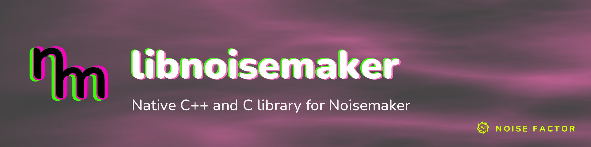

<!-- repo-hero -->
<a href="https://noisemaker.app/"></a>

<sub>Open source from <a href="https://noisefactor.io">Noise Factor</a> &middot; <a href="https://github.com/noisefactorllc">more projects</a></sub>

# libnoisemaker

> Run **Noisemaker** programs on the GPU from **C++** and **C**.

This library is under construction. Nothing here is ready to use yet.

## What is this?

**Noisemaker** is a procedural visual engine. You write short text programs, chains of effects, and
it renders live, animated GPU textures:

```
search synth, filter
noise(scaleX: 60).bloom().write(o0)
render(o0)
```

That language is Noisemaker's **DSL**. The original engine runs in the browser at
[noisedeck.app](https://noisedeck.app).

**libnoisemaker** is a native C++ library, with a C API, that runs [Noisemaker](https://noisemaker.app)
programs on the GPU through [Dawn](https://dawn.googlesource.com/dawn). It tracks Noisemaker 1.0.271,
the version locked in `parity/reference.json`.

## Requirements

CMake 3.22 or later, a C++20 compiler, Python 3.12 or later, Node.js 26, Git and Ninja (or Visual
Studio 2026 on Windows).

## Building

```sh
python3 tools/fetch_dawn.py
cmake -S . -B build -G Ninja -DCMAKE_BUILD_TYPE=Release
cmake --build build
ctest --test-dir build --output-on-failure
```

To build only the GPU-free compiler core and host helpers, with no Dawn tree, configure with
`-DNM_BUILD_GPU=OFF` and skip `fetch_dawn.py`.

## Contributing

Contributions follow the Noise Factor
[contributing policy](https://github.com/noisefactorllc/.github/blob/main/CONTRIBUTING.md) and
[Code of Conduct](https://github.com/noisefactorllc/.github/blob/main/CODE_OF_CONDUCT.md).

## Repo layout

```
include/noisemaker/   public C API headers
src/core/             GPU-free core: DSL lexer, parser and compiler, render graph, effect catalog, editing
src/host/             host inputs: audio and MIDI state, OBJ parsing, stroke raster, worm tracer
src/gpu/              Dawn device
src/capi/             C API implementation
tests/                C API, core, GPU, host and tool tests
parity/               reference lock, corpus and checks against the reference engine
scripts/              gate and reference entry points
tools/                Dawn fetch, catalog tools, reference oracles and dump tools
cmake/, third_party/  Dawn build integration and its lock
```

## License

MIT (see [LICENSE](LICENSE)). Dawn and its dependencies carry their own licenses (BSD-3-Clause,
Apache-2.0, MIT). Use of the Noisemaker and Noise Factor names in derivative products is subject to
the [Trademark Policy](TRADEMARK.md).

Copyright © 2026 Noise Factor LLC
